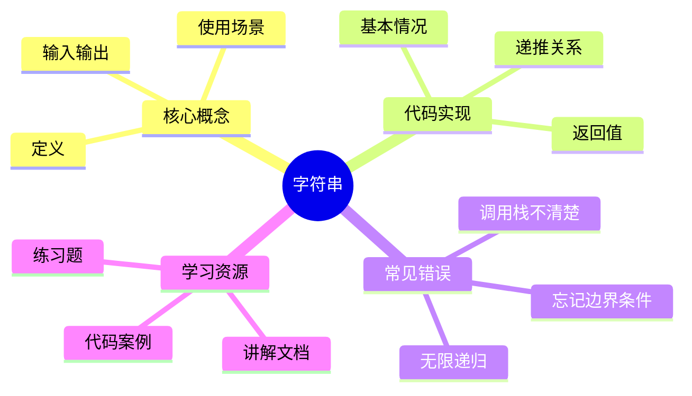

```mermaid
mindmap
  root((字符串))
    核心概念
      定义
      使用场景
      输入输出
    代码实现
      基本情况
      递推关系
      返回值
    常见错误
      忘记边界条件
      无限递归
      调用栈不清楚
    学习资源
      讲解文档
      练习题
      代码案例
```